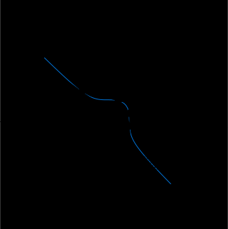

---
title: Canterbury 物语
author: [kokic](/kokic.md)
taxon: exegesis
!date: December 26, 2024
---

$\gdef\quads#1{\quad #1 \quad}$
$\gdef\eqq{\quads=}$

$\textbf{Problem.}$ 有两个正方体, 一个边长为 $1$, 另一个边长为 $2$. 请找到另外两个边长为有理数的正方体使它们的体积总和相同. 换言之, 求下述方程的一组 (正) 有理解. 

$$ x^3 + y^3 \eqq 9 \quad \color{gray}{(= \quad 1^3+2^3)} $$

$\textbf{Solution.}$ 我们先画出 $x^3 + y^3 = 9$. 然后由已知的 $P=(1,2)$ 出发做切线得到 $2P$, $4P$, $8P$. 这种几乎全凭借运气的操作是 [Fermat](https://en.wikipedia.org/wiki/Pierre_de_Fermat) 及 [Viète](https://en.wikipedia.org/wiki/Fran%C3%A7ois_Vi%C3%A8te) 研究此类问题的方式. 

<figure style="text-align: center;"></figure>

如图, 随后注意到 $8P$ 恰好位于 $x > 0,y > 0$ 的区域, 现在写出其坐标. 

$$ 8P \spaces= \left(\frac{1243617733990094836481}{609623835676137297449}, \frac{487267171714352336560}{609623835676137297449}\right) $$

[+切线与交点](/mille-plateaux/canterbury-000C.md#:embed)
[+](/mille-plateaux/fermat-ascent.md#:embed)
