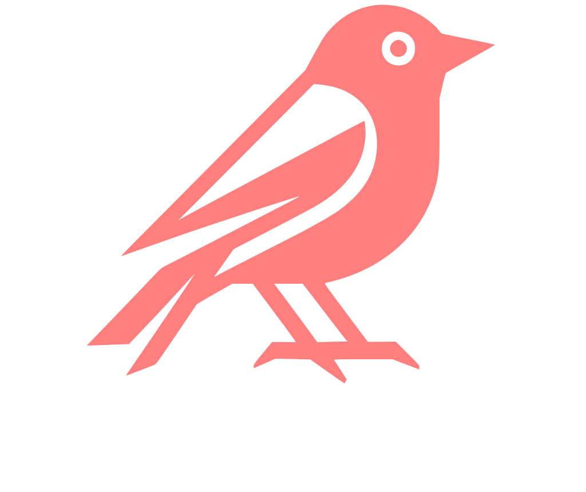
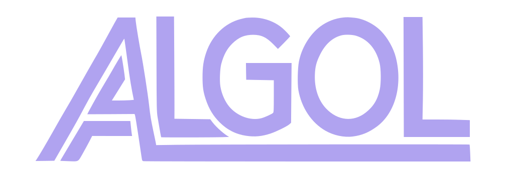

---
backlinks: false
title: Projects
author: [kokic](/kokic.md)
---

- [kodama](https://github.com/kokic/kodama)  --- A Typst-friendly static Zettelkästen site generator. GPL-3.0. 
- [algol](https://github.com/kokic/algol)  --- A experimental symbolic computation tool. MIT License. 
- [unitex.ts](https://github.com/kokic/UniTeX) --- A transpiler that converts TeX into Unicode. [Try it here](https://unitex-web.netlify.app). MIT License. 
- [unitex.rs](https://github.com/indekkusu4/unitex-rs) --- Rewrite unitex in Rust. GPL-3.0. W.I.P.
- [bitmap-docx](https://github.com/indekkusu4/bitmap-docx) --- A small CLI tool for merging bitmap files into a DOCX document. AGPL-3.0. 
